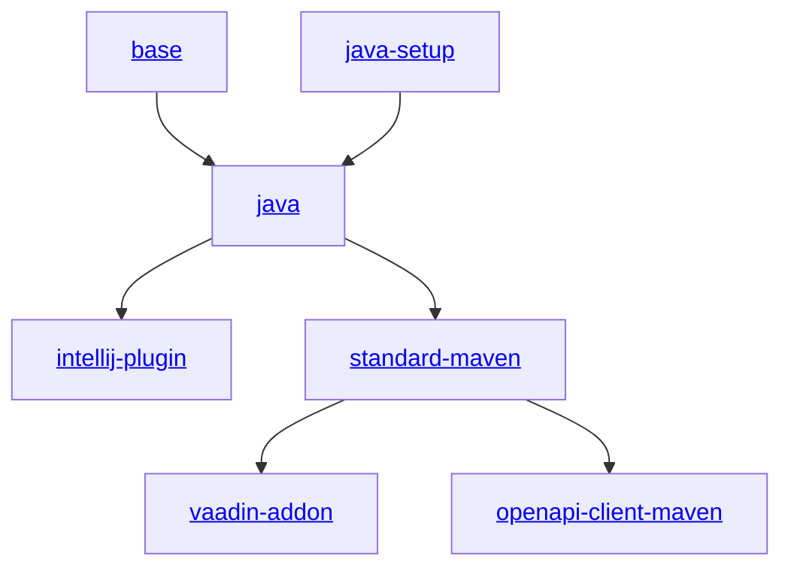

[](https://github.com/xdev-software/template-repo-topology-manager/actions/workflows/distribute.yml?query=branch%3Amaster)
# (Template) Repo Topology Manager

Distributes hierarchial repo updates (from templates) through the topology

## How can this be used?

### In a normal repo

1. Add the bot account to the repository (write permissions are sufficient)
2. The file `.config/topo/upstream.yml` must exist. It can look like this:
  ```yaml
  - url: https://github.com/xdev-software/standard-maven-template.git
    branch: master
  ```

### In a template

When inside a template the `.config/topo/upstream.yml` needs to be located in the `template-upstream/<org>/<repo>` branch.<br/>
This is required because the default branch's `.config/topo/upstream.yml` is used by the the downstream repositories.


## Template-Overview
_As of 2026-03_


